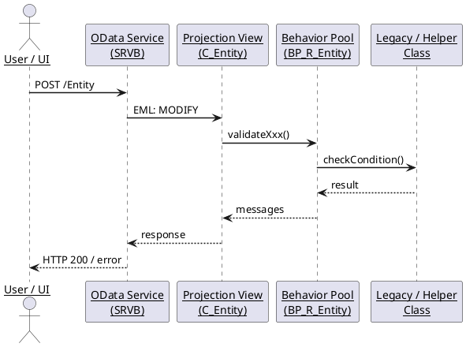
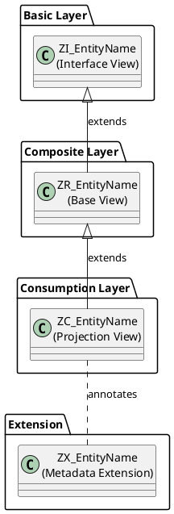
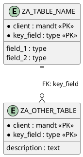
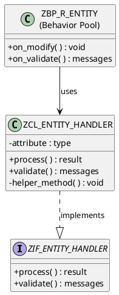

# PlantUML Diagram Guide

Templates for each diagram type used in the wiki. All diagrams are embedded as
raw PlantUML source inside `<pre>@startuml ... @enduml</pre>` — no rendering.

---

## Sequence / Application Flow Diagram

Use for: showing how a RAP action, validation, or OData call flows through layers.

---

## CDS View Hierarchy Diagram

Use for: showing the VDM layer structure (Basic → Composite → Consumption).

---

## Database Table Entity Diagram

Use for: showing database table fields, keys, and FK relationships.

---

## Class Diagram

Use for: showing ABAP classes, interfaces, inheritance, and key methods.

---

## PlantUML Tips

- Long participant names: use `\n` for line breaks inside labels
- Omit arrows for passive dependencies; use dashed `..>` for optional/event-driven flows
- For tables with many fields: show only key fields and 3-4 most important fields; add `-- (N more fields) --` comment
- Keep diagrams focused — one diagram per concern; do not combine all four into one mega-diagram
